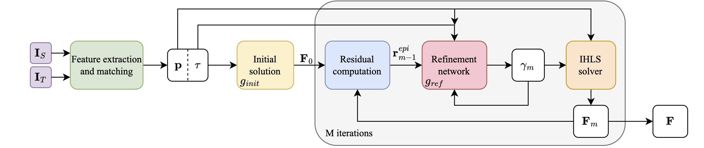

#  Robust Two-View Geometry Estimation with Implicit Differentiation
> TL;DR  
> 1. Classic IHLS solver outperforms MAGSAC++ on the Fundamental Matrix Estimation Task;
> 2. Learning-based IHLS+WPN outperforms other approaches on the Essential Matrix Estimation Task;
> 3. No RANSAC-like hypothesis sampling/evaluation/filtering is required during training.
## [Paper](https://arxiv.org/abs/2410.17983)
> [Vladislav Pyatov](https://scholar.google.com/citations?user=xwiCaecAAAAJ&hl=en), [Iaroslav Koshelev](https://openreview.net/profile?id=%7EIaroslav_Sergeevich_Koshelev1), [Stamatis Lefkimmiatis](https://scholar.google.com/citations?user=3Bawtm4AAAAJ&hl=en)  
> IROS 2024

# Installation
```bash
conda env create --file environment.yaml
conda activate ihls
pip install -r requirements.txt
```

# Run IHLS
## Demo
You can try the IHLS solver in `demo.ipynb`

## Reproduce train
See [Training IHLS](./docs/IHLS_TRAINING.md) for details.
## Reproduce test
To reproduce the results from our paper, setup the testing subsets of ScanNet and MegaDepth according to [LoFTR](https://github.com/zju3dv/LoFTR?tab=readme-ov-file#reproduce-the-testing-results-with-pytorch-lightning). Then download [weights](https://drive.google.com/drive/folders/1JI2fLXG3vfUX9Wi2ijgQdu_wEE6F7DzL?usp=sharing) and run
```bash
mkdir weights
mv /path/to/weights.ckpt weights/
# test IHLS solver with weight prediction network (outdoor)
bash scripts/reproduce_test/outdoor_ds_irls.sh
# test IHLS solver with weight prediction network (indoor)
bash scripts/reproduce_test/indoor_ds_new_irls.sh
# test IHLS solver without weight prediction network (outdoor)
bash scripts/reproduce_test/outdoor_ds_irls_solver.sh
```

## Acknowledgements
Our code is based on the following awesome repositories:

- [LIRLS](https://gitee.com/ys-koshelev/models/tree/lirls/research/cv/LIRLS)
- [DFE](https://github.com/isl-org/DFE)
- [LoFTR](https://github.com/zju3dv/LoFTR)

We thank the authors for releasing their code!